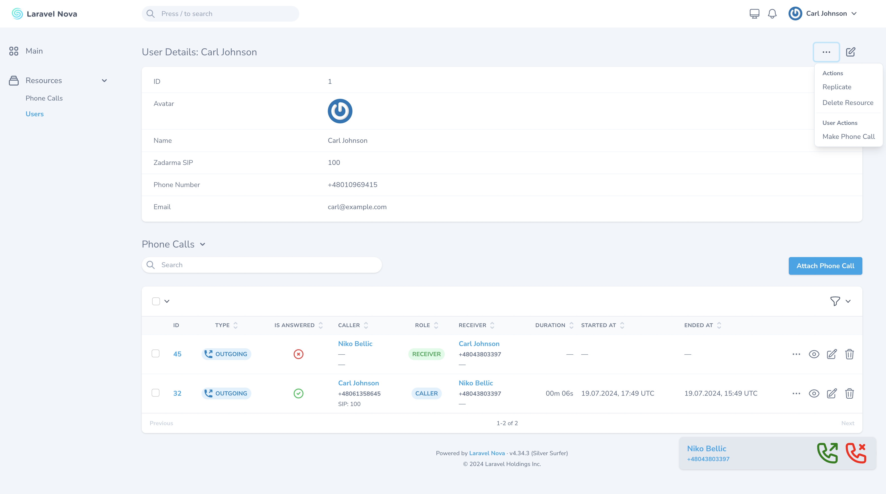
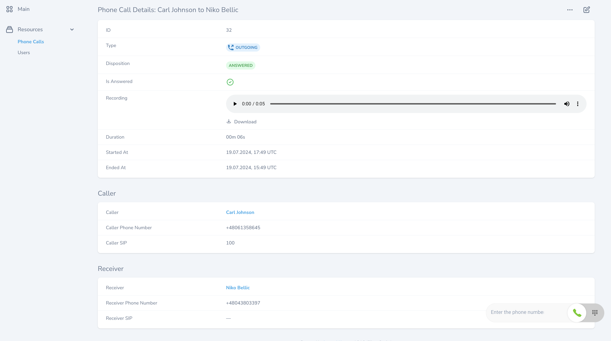
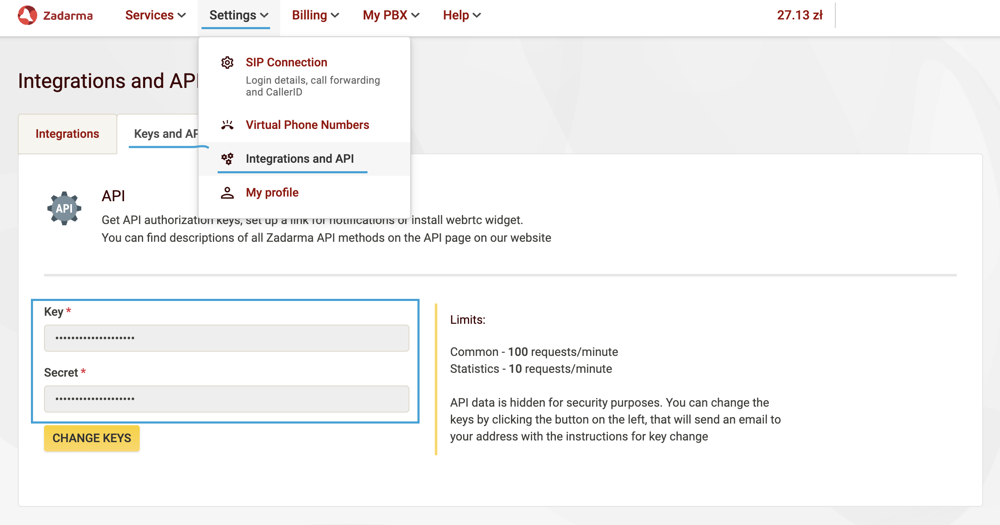
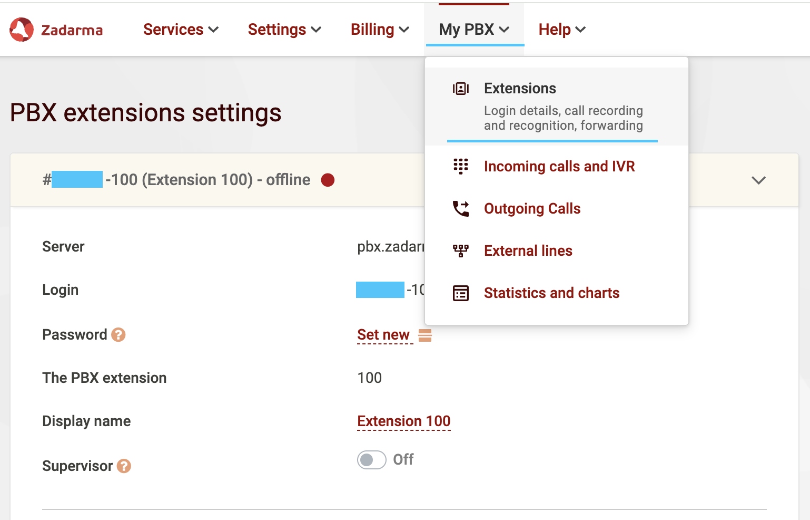
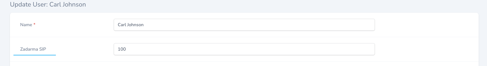
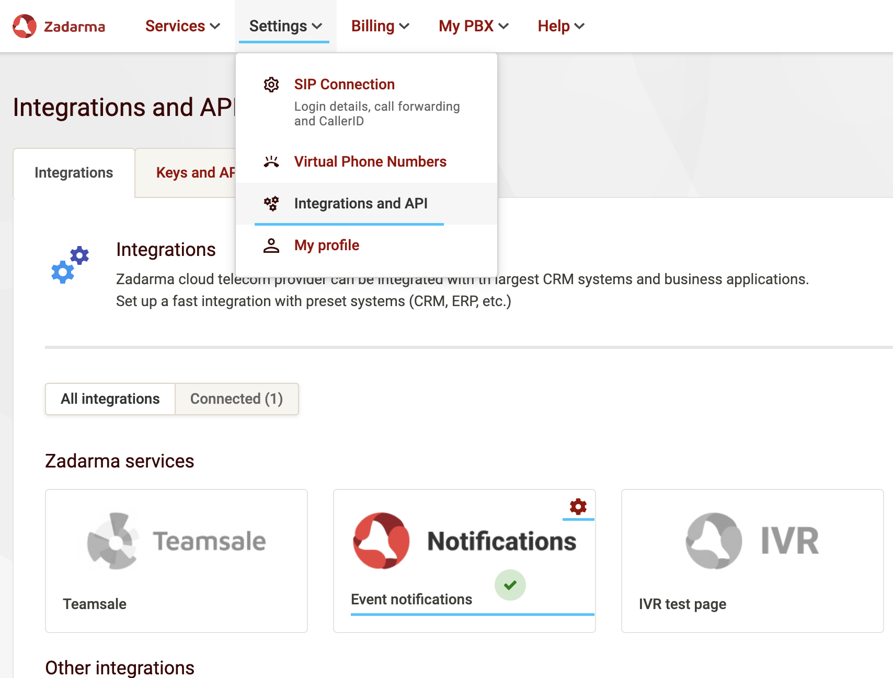
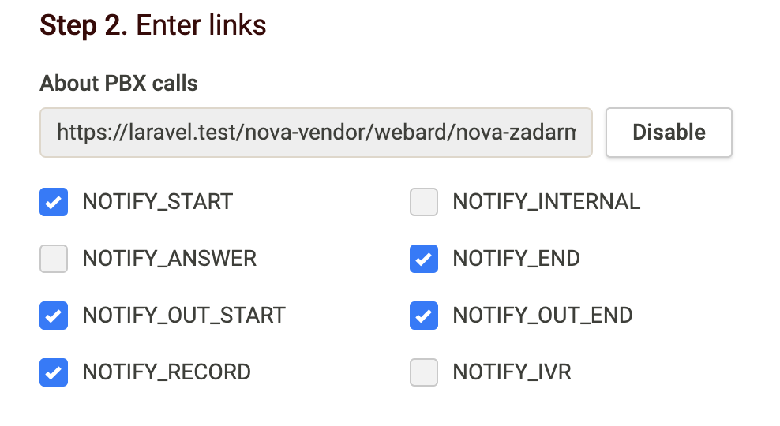

# Laravel Nova Zadarma VoIP Integration

## Description

This package provides integration between Laravel Nova and the Zadarma VoIP service. It allows you to make, receive and manage phone calls directly from your Nova interface!





## Installation

### Step 1: Install the package

Run the following command to install the package:

```sh
composer require webard/nova-zadarma
```

### Step 2: Publish the configuration

Publish the package configuration using the following command:

```sh
php artisan vendor:publish --provider="Webard\NovaZadarma\NovaZadarmaServiceProvider" --tag=config
```

### Step 3: Provide API keys from Zadarma

Add this lines to `.env` file and fill them:

```sh
ZADARMA_KEY=
ZADARMA_SECRET=
ZADARMA_SIP_LOGIN=
```

Zadarma Secret and Key you can find in Settings -> Integrations and API -> Keys and API:



Zadarma SIP Login is the suffix of PBX number, which can be found under My PBX -> Extensions.

Your SIP Login is behind the painted field.



### Step 4: Publish the migrations

Publish the package migrations using the following command:

```sh
php artisan vendor:publish --provider="Webard\NovaZadarma\NovaZadarmaServiceProvider" --tag=migrations
```

### Step 5: Register tool in `NovaServiceProvider`

```php
use Webard\NovaZadarma\NovaZadarmaTool;

public function tools()
{
    return [
        ...
        NovaZadarmaTool::make(),
    ];
}
```

### Step 6: Update the User model

1. Add the `HasPhoneCalls` trait to the User model
2. Add `zadarma_sip` and `phone_number` to `$fillable` property
3. Cast `phone_number` field to ` E164PhoneNumberCast::class`.


```php
use Propaganistas\LaravelPhone\Casts\E164PhoneNumberCast;
use Webard\NovaZadarma\Traits\HasPhoneCalls;

class User extends Authenticatable {
    use HasPhoneCalls;

    protected $fillable = [
        ...
        'zadarma_sip',
        'phone_number'
    ];

     protected function casts(): array
    {
        return [
            ...
            'phone_number' => E164PhoneNumberCast::class,
        ];
    }
}
```

### Step 7: Modify User resource

1. Add `Zadarma SIP` field
2. Add `Phone Number` field
3. Add `UserPhoneCalls` field


```php
use Webard\NovaZadarma\Nova\Fields\UserPhoneCalls;

class User extends Resource {
    public function fields(NovaRequest $request)
    {
        return [
            ...
            Text::make(__('Zadarma SIP'), 'zadarma_sip')
                ->sortable()
                ->nullable()
                ->rules('nullable', 'max:4'),

            Text::make(__('Phone Number'), 'phone_number')
                ->sortable()
                ->rules('nullable', 'max:20', 'phone'),

            UserPhoneCalls::make(),
        ];
    }
}
```

### Step 8: Add the phone call action to the User resource

Add the `MakePhoneCall` action to the User resource:

```php
use Webard\NovaZadarma\Nova\Actions\MakePhoneCall;

class User extends Resource {
    public function actions(NovaRequest $request)
    {
        return [
            ...
            MakePhoneCall::make()
                ->sole()
        ];
    }
}
```

> [!WARNING]
> `MakePhoneCall` action must be `sole`, because User can make call to only one user at time.

> [!TIP]
> You can add `->withoutConfirmation()` method to action to allow making phone calls directly after clicking action.

### Step 9: Fill SIP Number in your User profile of Nova

Go to your User edit form and fill `Zadarma SIP` according to SIP number in Zadarma panel. Default created SIP number is 100:



## Webhooks

### Step 1: Enable "Notifications" in integrations 

Go to Settings -> Integrations and API -> Integrations in Zadarma Panel and enable "Notifications" integration.



### Step 2: Fill settings of "Notifications" integration

Go to Notifications settings and enter webhook URL:

```
https://YOUR-DOMAIN.com/nova-vendor/webard/nova-zadarma/webhook
```

and enable checkboxes:
- NOTIFY_START
- NOTIFY_END
- NOTIFY_OUT_START
- NOTIFY_OUT_END
- NOTIFY_RECORD




### Step 3: Add webhook URL to ignore

Go to `bootstrap/app.php` file and modify `withMiddleware` method:

```php
return Application::configure(basePath: dirname(__DIR__))
    ->withMiddleware(function (Middleware $middleware) {

        $middleware->validateCsrfTokens(except: [
            '/nova-vendor/webard/nova-zadarma/webhook',
        ]);
        
    })
    ->withExceptions(function (Exceptions $exceptions) {
        //
    })
    ->create();
```

If you have `fruitcake/laravel-telescope-toolbar` installed, add webhook URL to `ignore_paths` in `config/telescope-toolbar.php`


```php
'ignore-paths' => [
    'nova-vendor/webard/nova-zadarma/webhook'
]
```

## TODO

I'm are actively seeking contributions to enhance this package. Here are some features I would love to see implemented:

- [ ] documentation for Gate
- [ ] documentation for Events
- [ ] ability to go offline (disable widget on demand)
- [ ] more options for icon in header
- [ ] after call action modal with customized fields (feedback modal)
- [ ] phone call transcriptions using OpenAI/Google Speech To Text/Assembly.ai
 
## Contributing

We welcome contributions to improve this plugin! Please follow these steps to contribute:

1. Fork the repository.
2. Create a new branch for your feature or bug fix.
3. Make your changes and commit them with descriptive messages.
4. Push your changes to your forked repository.
5. Open a pull request to the main repository.

## License

This project is licensed under the MIT License. See the [LICENSE.md](LICENSE.md) file for more details.

## Contact

For questions or support, please open an issue on GitHub.
